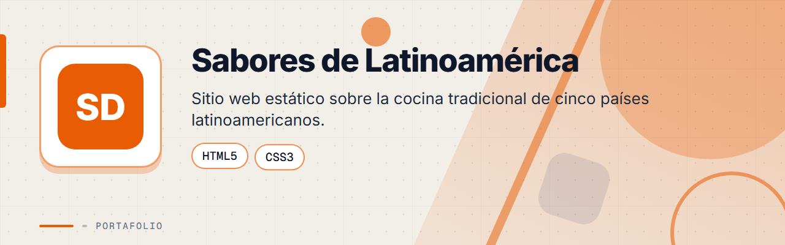
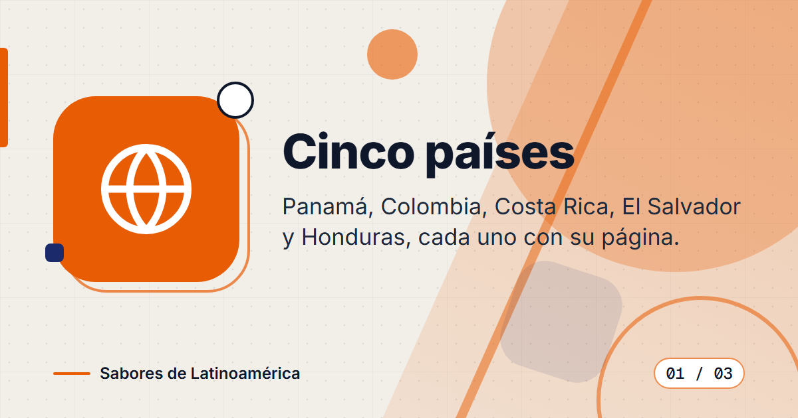
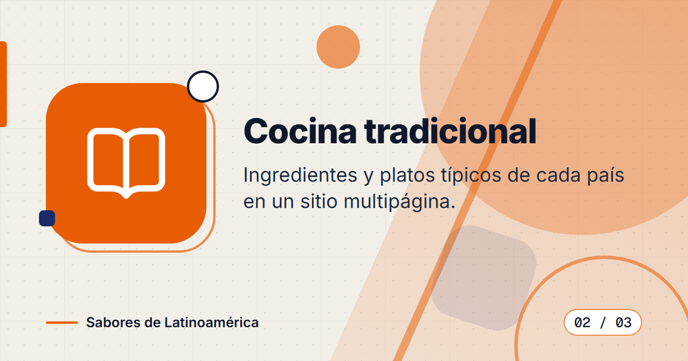
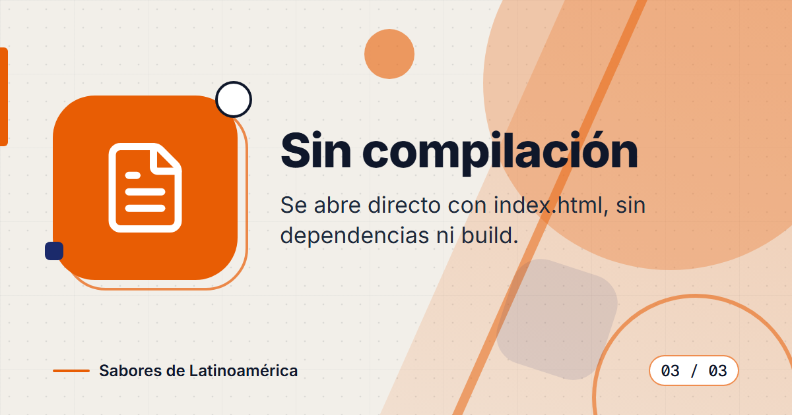

<div align="center">



# Sabores de Latinoamérica


**Sitio web estático y multipágina sobre la cocina tradicional de Colombia, Panamá, Honduras, El Salvador y Costa Rica, hecho solo con HTML y CSS.**

</div>

---

## Contenido

- [El Problema](#el-problema)
- [La Solución](#la-solución)
- [Funcionalidades](#funcionalidades)
- [Vista Previa](#vista-previa)
- [Estructura del proyecto](#estructura-del-proyecto)
- [Stack Tecnológico](#stack-tecnológico)
- [Instalación](#instalación)
- [Contexto académico](#contexto-académico)
- [Licencia](#licencia)
- [Contacto](#contacto)

---

## El Problema

La gastronomía de América Central y del Sur es muy diversa, pero rara vez se presenta en un solo lugar, con sus platos típicos organizados por país y fáciles de recorrer.

---

## La Solución

Un sitio estático con una página de inicio y una página por país. Cada página muestra tres platos típicos con su foto, su categoría, una lista de ingredientes y los pasos de preparación. No requiere compilación ni servidor: basta abrir `index.html` en el navegador.

---

## Funcionalidades

| Funcionalidad | Descripción |
|---------------|-------------|
| Inicio | Portada con el título del sitio, los cinco países y enlaces directos a cada uno |
| Una página por país | Colombia, Panamá, Honduras, El Salvador y Costa Rica, cada una con imagen principal y una frase introductoria |
| Tarjetas de platos | Tres platos por país, con foto, etiqueta de categoría (sopa, entrada, plato fuerte, desayuno y otras), ingredientes y pasos |
| Navegación | Barra de enlaces entre países, con la página actual resaltada |
| Sin dependencias | Solo HTML y CSS: sin JavaScript, sin gestores de paquetes y sin paso de compilación |

---

## Vista Previa



<table>
  <tr>
    <td width="50%">
      
      <br><b>Cocina tradicional</b>: platos típicos, ingredientes y pasos por país.
    </td>
    <td width="50%">
      
      <br><b>Sin compilación</b>: se abre directamente en el navegador.
    </td>
  </tr>
</table>

---

## Estructura del proyecto

```text
sabores/
├── index.html          # Inicio con enlaces a los países
├── colombia.html       # Una página por país
├── panama.html
├── honduras.html
├── elsalvador.html
├── costarica.html
├── css/styles.css      # Estilos compartidos
├── img/                # Fotos de platos y portadas de cada país
└── assets/             # Banner y tarjetas de este README
```

---

## Stack Tecnológico

| Capa | Tecnología |
|------|-----------|
| Marcado | HTML5 |
| Estilos | CSS3 (variables personalizadas, grid y flexbox) |
| Contenido | Páginas estáticas, sin base de datos ni JavaScript |

---

## Instalación

No requiere compilación ni dependencias. Solo necesitas un navegador.

1. Clona el repositorio:
   ```bash
   git clone https://github.com/deadlyrat/sabores.git
   cd sabores
   ```
2. Abre `index.html` en el navegador:
   ```bash
   start index.html       # Windows
   open index.html        # macOS
   xdg-open index.html    # Linux
   ```

---

## Contexto académico

Desarrollado como proyecto universitario para el curso de Fundamentos Web en la Universidad Tecnológica de Panamá. Demuestra estructura HTML, estilos CSS y organización de un sitio estático multipágina.

---

## Licencia

Distribuido bajo la licencia MIT. Consulta el archivo [LICENSE](LICENSE).

---

## Contacto

Para consultas o propuestas, escríbeme:

[](mailto:pablozam1931@gmail.com)
[%206517--1870-25D366?style=for-the-badge&logo=whatsapp&logoColor=white)](https://wa.me/50765171870)
[](https://github.com/deadlyrat)

- Correo: [pablozam1931@gmail.com](mailto:pablozam1931@gmail.com)
- WhatsApp: [(507) 6517-1870](https://wa.me/50765171870)
- GitHub: [github.com/deadlyrat](https://github.com/deadlyrat)

---

*Parte del portafolio de [deadlyrat](https://github.com/deadlyrat)*
